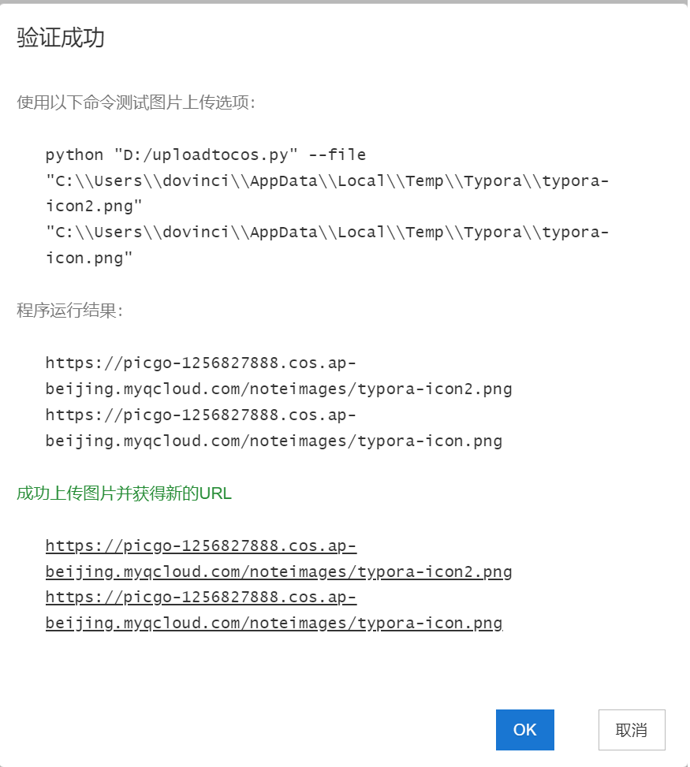

# Typora-Images-Upload-to-Tencent-COS（PicGo平替+腾讯云COS图床）

COS Image-Bed, A Python Program for Images Uploading to COS Storage Bucket of Tencent Cloud by Typora Custom Command.

腾讯云COS图床，Typora中通过自定义命令行将插入的图片自动上传到腾讯云COS存储桶并返回存储桶的图片链接。

**问题：为什么存储图片、图床用腾讯云COS存储桶而不用Github仓库或其他云存储？**

答：GitHub仓库最多500MB容量太小不建议，亲自试用过其他云存储服务和腾讯比性能（稳定性、速度等）方面逊色，此外腾讯云价格优惠20G标准存储+流量请求次数包用5年60元，618、开学季、双11等活动价格更优惠，还可申请腾讯云校园计划免费使用。

## Step-1 Install the Tencent COS SDK

```shell
pip install cos-python-sdk-v5
```

## Step-2 Set system environment variables

**Note**: reboot after Setting system environment variables.

### **Windows**：

主账户新建存储桶，设置存储桶所在地区和名称，在存储桶下新建文件夹 noteimages这就是图片存储路径如 noteimages/。
存储桶API的ID和秘钥在腾讯云账号中心-->访问管理-->用户-->用户列表-->新建子账户页面新建子账户，点击子账户后获取API的ID和秘钥。

1. 子账户的权限中关联策略选择 QcloudCOSFullAccess 对象存储（COS）全读写访问权限 直接关联。
2. 子账户的API的ID SecretId 和 SecretKey密钥 ，新建密钥并保存。

```shell
setx COS_SECRET_ID "your_secret_id"  # 存储桶API的ID
setx COS_SECRET_KEY "your_secret_key"  # 存储桶API的秘钥
setx COS_REGION "your_region"  # 存储桶所在地区
setx COS_BUCKET "your_bucket"  # 存储桶名称
setx COS_UPLOAD_PATH "upload_path"  # 存储桶图片存储路径,不设置就直接上传到存储桶根目录。例如 noteimages/ 此路径是存储桶下面的文件夹。
```

or

**Setting environment variables through the system setup interface**(也可直接在系统属性的系统环境变量中设置)

### **macOS/Linux**：

Add the following to the ~/.bashrc or ~/.zshrc file:

```shell
export COS_SECRET_ID="your_secret_id"
export COS_SECRET_KEY="your_secret_key"
export COS_REGION="your_region"
export COS_BUCKET="your_bucket"
export COS_UPLOAD_PATH "upload_path"
```

## Step-3 Put the file upload_to_cos.py in your custom path on Windows

For example: D:/uploadtocos.py

Put the file uploadtocos.py in your custom path in Windows(将程序文件复制到自定义路径)

## Step-4 Set the image upload setting of Typora on Windows

In the image upload setting of Typora, set 

**Image Uploader** : Custom Command

**Command** : python "D:/uploadtocos.py" --file

Preferences->Image->Image Upload Settings->Image Uploader->Custom Command, Select the corresponding command as follows.

在Typora的 偏好设置-->图像-->上传服务设定中-->上传服务-->选择 自定义命令，根据需要选择相应命令如下：

| Program File                 | Custom Path        | Command                                               |
| :--------------------------- | :----------------- | :---------------------------------------------------- |
| Python program file          | D:/uploadtocos.py  | python "D:/Program Files (x86)/uploadtocos.py" --file |
| Packaged exe file on Windows | D:/uploadtocos.exe | "D:/Program Files (x86)/uploadtocos" --file           |

**Upload Success as following picture!**



If you need to use the uploadtocos.exe file on Windows, please refer to the Program Packaging Instructions file and Package the python program by yourself. Using the uploadtocos program on a Linux is the same as above.

If you encounter any issues while using this repo, please contact me.

**Good! That's All** 


## Star History

[](https://www.star-history.com/#malhotra5/Manim-Tutorial&logistc/typora-images-upload&Date)
